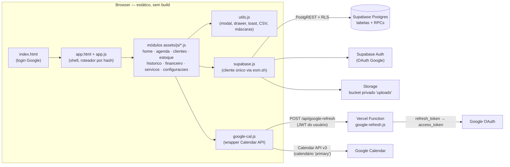

# Rodada 7 — Diagnóstico Geral (2026-07-02)

> Diagnóstico técnico completo sob 3 lentes independentes (Engenharia de
> Software, Full Stack Sênior, UI/UX), consolidado ao final. **Somente
> diagnóstico** — nenhuma correção foi aplicada. Itens já resolvidos em rodadas
> anteriores (ver `HISTORICO.md`) não são repetidos; pendências de verificação
> da Rodada 6 estão nas Observações finais.

---

## Visão geral do produto

**O que é.** CRM vertical para **profissionais de saúde estética** que
trabalham sozinhas (clínica solo). Resolve a gestão do dia a dia num só lugar:
agenda (espelhada no Google Calendar), cadastro de clientes, catálogo de
serviços, estoque de materiais com lista de compras, registro de procedimentos
com custo/lucro por atendimento e fluxo de caixa com parcelas.

**Proposta de valor.** Não é um CRM genérico: o fluxo central é
*agendar → atender → registrar procedimento → debitar materiais → gerar
parcelas no caixa*, tudo encadeado por RPCs atômicas no Postgres
(`schedule_procedure` / `complete_procedure` / `register_procedure`). O lucro
por procedimento congela o custo dos materiais no momento do uso
(`procedure_materials.unit_cost_at_time`) — métrica que planilha nenhuma dá de
graça. Diferenciais secundários: lembretes de retorno por cliente+serviço
(marcos 1/3/6/12 meses), reativação via WhatsApp e lista de compras com links
de recompra.

**Modelo de uso.** Multi-tenant por conta Google: cada `user_id` (auth.users)
enxerga só os próprios dados via RLS em todas as tabelas (confirmado em
`db/schema.sql`, bloco `do $$` de RLS, linhas 254-268). **Não há camada de
billing/assinatura no schema** — nenhuma tabela de plano, trial ou pagamento
do próprio SaaS. O modelo implícito hoje é uso direto (uma profissional, uma
conta), com o limite externo de 100 usuários de teste do OAuth não verificado
do Google.

**Estágio atual.** Em produção em `https://harmon-ia-rouge.vercel.app`, com
todos os 8 módulos funcionais (Etapas 1-6 + Rodadas 3-6). O checklist de
status do `README.md:76-80` está **desatualizado** (marca Clientes/Estoque/
Histórico/Caixa/Agenda como pendentes — todos prontos), assim como o rodapé do
`PLANO.html:232` (parou na Rodada 4). Pendências reais: Etapa 7 (Polish/
Lançamento) e as verificações visuais da Rodada 6.

---

## Como o produto funciona hoje

**Stack:** HTML + CSS + JS vanilla **sem build** (ES modules servidos
estáticos), Supabase (Postgres + Auth + Storage + RLS), Google Calendar via
OAuth, e uma única função serverless (`api/google-refresh.js`, Vercel) que
troca o `google_refresh_token` por um `access_token` fresco — a única peça que
precisa do `client_secret`.

**Módulos e arquivos:**

| Módulo | Arquivo | O que faz |
|---|---|---|
| Início | `assets/js/home.js` | Métricas do mês, próximos agendamentos, estoque crítico, retornos, atalhos `intent:*` |
| Agenda | `assets/js/agenda.js` | Views Lista/Dia/Mês do Google Calendar + `schedule/complete/cancel_procedure`; rascunhos |
| Serviços | `assets/js/servicos.js` | CRUD do catálogo (preço padrão, duração, cor); padrão de referência |
| Estoque | `assets/js/estoque.js` | CRUD + movimentações, upload foto/NF, lista de compras, links de recompra |
| Clientes | `assets/js/clientes.js` | CRUD + perfil em drawer (abas Procedimentos/Financeiro), ganchos `intent:*` |
| Histórico | `assets/js/historico.js` | Registro via RPC `register_procedure`, listagem, Reativação e Retornos |
| Fluxo de Caixa | `assets/js/financeiro.js` | `financial_entries` em 5 abas, dar baixa, lançamento manual, CSV |
| Configurações | `assets/js/configuracoes.js` | Conta, WhatsApp admin, reconectar Google, tema/acento, backup JSON |

**Autenticação e multi-tenancy.** `index.html` chama
`signInWithGoogle()` (`auth.js:11`) com escopo Calendar +
`access_type=offline&prompt=consent`; no retorno, `ensureSettings()` persiste
o `provider_refresh_token` em `user_settings`. `app.js` guarda a rota via
`requireSession()`. O isolamento é 100% RLS: policy única `own_data`
(`auth.uid() = user_id`, USING + WITH CHECK) em todas as 11 tabelas, e o
bucket `uploads` exige prefixo `<uid>/` no path (`schema.sql:580-584`). As
RPCs são `security invoker` e usam `v_user := auth.uid()` — não há caminho
óbvio de vazamento entre contas. Os pontos onde o modelo *afina* estão nos
achados (token do Google no browser; colunas sem CHECK).

**Fluxo representativo 1 — criar um agendamento.**
Home ou Agenda → `openForm()` (`agenda.js:312`) → autocomplete de cliente +
serviço (herda duração/preço) + materiais reservados →
`createEvent()` no Google (`google-cal.js:50`; o token vem de
`/api/google-refresh`, cacheado ~1h em memória) → RPC `schedule_procedure`
(`schema.sql:365`): cria `procedures(status='scheduled')` com o
`google_event_id`, congela custo dos materiais em `procedure_materials`
**sem debitar estoque** e gera N parcelas pendentes em `financial_entries`.
Se a RPC falhar, o evento do Google é deletado (rollback, `agenda.js:529`).
Ao reabrir a Agenda, `autoCompletePast()` (`agenda.js:140`) chama
`complete_procedure` para todo agendamento com data passada: debita estoque,
confirma pagamento à vista e muda o status — aí o valor aparece no Caixa e no
Histórico.

**Fluxo representativo 2 — registrar um procedimento avulso.**
Histórico → modal (`historico.js:275`) → RPC `register_procedure`
(`schema.sql:275`): numa única transação cria o procedimento já `completed`,
snapshot de custo + `stock_transactions('out')` + débito de
`stock_items.quantity`, e 1 lançamento pago (à vista) ou N parcelas mensais
(última absorve o resto do arredondamento). A UI valida saldo de estoque
client-side; a RPC confia no chamador.

**Design system.** `tokens.css` (paleta crua mauve + tokens semânticos +
tipografia Satoshi variável + espaçamento 4px + motion), `accent.css` (5
paletas que redefinem só os 4 tons mauve), `layout.css` (shell/login/
responsivo), `components.css` (botões, forms, segmented, tabelas, modal/
drawer, toasts, skeletons, agenda), `theme.css` (dark = só tokens semânticos).
A arquitetura de tokens é consistente e bem executada; o uso *nos módulos* é
majoritariamente fiel, mas com bastante estilo inline pontual (ver achados de
UX).

---

## Análise — Engenheiro de Software

### ES-1 · Conclusão automática de agendamentos passados sem confirmação nem reversão — **Alta**
- **Onde:** `assets/js/agenda.js:140-144` (`autoCompletePast`) + `db/schema.sql:511` (`complete_procedure`) e `schema.sql:561` (`cancel_procedure`).
- **O que acontece:** abrir a tela da Agenda conclui *silenciosamente* todo
  procedimento `scheduled` com data < hoje: debita estoque, cria
  `stock_transactions` e confirma pagamento à vista. Um **no-show vira
  receita recebida e material consumido** sem nenhuma ação da profissional. E
  não existe operação inversa: `cancel_procedure` não tem guarda de status
  (cancela até um `completed`), não devolve estoque nem estorna lançamentos
  pagos — cancelar depois da auto-conclusão deixa o banco inconsistente
  (procedimento "cancelado" com estoque debitado e parcela paga).
- **Por que é problema:** integridade financeira e de estoque são o coração do
  produto; aqui elas dependem de a cliente ter comparecido, fato que só a
  profissional sabe.
- **Direção:** trocar auto-conclusão por **revisão explícita** (ex.: painel
  "3 atendimentos de ontem — confirmar / marcar falta") ou, no mínimo, exigir
  guarda `status='scheduled'` no `cancel_procedure` e criar uma RPC de
  estorno (devolve estoque + remove/estorna lançamentos) para desfazer
  conclusões indevidas.

### ES-2 · `google_refresh_token` trafega para o browser, contrariando o próprio design — **Alta**
- **Onde:** `assets/js/app.js:56` (`select('*')` em `user_settings`) vs. o
  comentário de design em `api/google-refresh.js:8` ("o token nunca trafega
  pelo browser").
- **O que acontece:** `loadSettings()` seleciona `*`, incluindo
  `google_refresh_token` — a credencial de longa duração (acesso total ao
  Calendar) fica em memória JS a cada boot do app. O backup
  (`configuracoes.js:165`) até a remove explicitamente, mas o boot a expõe.
- **Por que é problema:** não é vazamento entre tenants (RLS limita à própria
  linha), mas qualquer XSS, extensão maliciosa ou dependência CDN comprometida
  exfiltra um token que **não expira** e dá acesso à agenda pessoal da
  usuária. A função serverless existe exatamente para evitar isso.
- **Direção:** selecionar colunas explícitas no `loadSettings()` (quick win) e,
  estruturalmente, tirar a coluna do alcance do cliente: `revoke select` na
  coluna para o role `authenticated` (mantendo a função serverless lendo via
  service role) ou mover o token para tabela sem policy de select, gravado por
  RPC `security definer`.

### ES-3 · Dependência flutuante: `@supabase/supabase-js@2` via esm.sh sem versão travada — **Média**
- **Onde:** `assets/js/supabase.js:5`.
- **O que acontece:** `https://esm.sh/@supabase/supabase-js@2` resolve para a
  *última* 2.x a cada cache-miss do CDN. O app pode mudar de comportamento
  sem nenhum deploy, e um incidente no esm.sh derruba o login inteiro.
- **Por que é problema:** builds não reprodutíveis + ponto único de falha
  externo na dependência mais crítica do app.
- **Direção:** travar versão exata (`@supabase/supabase-js@2.x.y`) e,
  idealmente, self-host do bundle em `assets/vendor/` (coerente com o projeto,
  que já self-hosta fonte e ícones).

### ES-4 · Colunas de domínio sem CHECK constraints — **Média**
- **Onde:** `db/schema.sql` — `stock_transactions.type` (linha 94),
  `procedures.status` (112), `financial_entries.type/payment_method/amount`
  (133-137), `user_settings.theme/accent` (29-30), `return_dismissals.months`
  (183).
- **O que acontece:** os valores válidos vivem só em comentários e no JS. Um
  insert com typo (`'expence'`, status `'done'`) entra sem erro e some dos
  filtros — todos os módulos filtram por igualdade estrita dessas strings.
- **Por que é problema:** o banco é a última linha de defesa num app onde o
  cliente escreve direto via PostgREST; hoje ela não existe para enums nem
  para `amount > 0` / `quantity > 0`.
- **Direção:** `check (type in ('in','out'))` etc. + `check (amount > 0)`,
  em migração idempotente `not valid` (mesmo padrão da FK da Rodada 6).

### ES-5 · Estratégia fetch-tudo + filtro em memória: teto conhecido, sem plano de corte — **Média**
- **Onde:** `clientes.js:60` (embed `procedures(date)` de todos os clientes),
  `historico.js:104-107` (todos os procedimentos + materiais),
  `financeiro.js:101-104` (todos os lançamentos + embed
  `procedures→procedure_materials` por linha), `home.js:48-54` (5 tabelas
  inteiras a cada abertura do dashboard).
- **O que acontece:** cada navegação re-baixa tabelas inteiras com embeds
  aninhados. Os comentários `ponytail:` reconhecem o teto ("vira view/RPC se
  acumular milhares"), mas 2 anos de uso real (~15 atendimentos/semana ≈ 1.500
  procedimentos + 3-6 mil lançamentos) chegam nesse teto de payload/parse,
  principalmente no 4G.
- **Por que é problema:** a degradação será lenta e difusa (app "vai ficando
  lento") em vez de um erro visível; sem monitoramento (ES-7) ninguém vai
  atribuir a causa.
- **Direção:** definir o gatilho de migração agora (ex.: >500 linhas → view
  agregada p/ Clientes, range de datas default de 12 meses p/ Histórico/Caixa
  com "carregar mais"). Não precisa executar já — precisa estar decidido.

### ES-6 · Edição de agendamento pode duplicar parcelas já baixadas — **Média**
- **Onde:** `db/schema.sql:487-502` (`update_scheduled_procedure` apaga só
  `paid = false` e recria **todas** as N parcelas) + `financeiro.js:221`
  (qualquer pendência aceita "Dar baixa", inclusive categoria
  'Agendamentos').
- **O que acontece:** a profissional recebe um sinal adiantado → dá baixa na
  parcela 1 de um procedimento ainda `scheduled` → depois edita o agendamento
  (troca valor/materiais). A RPC apaga as pendentes, mantém a paga e recria as
  N parcelas do zero: o total lançado passa a ser `valor + parcela_paga`.
- **Por que é problema:** corrompe o caixa exatamente no caso de uso real de
  "sinal/entrada", que é comum em estética.
- **Direção:** na RPC, abortar com erro amigável se existir parcela paga
  (`if exists (... paid) then raise`), ou recriar apenas o valor residual.
  Alternativa de produto: bloquear "Dar baixa" em parcelas de procedimentos
  ainda agendados.

### ES-7 · Observabilidade zero em produção — **Média**
- **Onde:** todo o frontend (`console.error` em ~40 pontos) e
  `api/google-refresh.js` (sem log estruturado).
- **O que acontece:** quando Supabase, Google ou a função de refresh falham em
  produção, o único registro é o console do browser da usuária. O bug do
  Fluxo de Caixa da Rodada 6 (PGRST200) ficou invisível até o usuário reportar
  "não carrega".
- **Por que é problema:** o app tem 2 integrações externas e RPCs financeiras;
  falhas silenciosas custam confiança da usuária final (que não vai abrir o
  F12).
- **Direção:** um `window.onerror`/`unhandledrejection` global que envie para
  um endpoint barato (Sentry free tier, ou até uma tabela `client_errors` no
  próprio Supabase com RLS de insert-only) + log em caso de `!r.ok` na função
  Vercel (os logs da Vercel já capturam `console.error`).

### ES-8 · `register/schedule_procedure` aceitam `stock_item_id` de outro tenant sem erro — **Baixa**
- **Onde:** `db/schema.sql:315-332` e `402-410` — o `select cost_price ... where user_id = v_user` devolve `null` para item alheio, mas os inserts em `procedure_materials`/`stock_transactions` acontecem mesmo assim, com o UUID estrangeiro e custo nulo.
- **O que acontece:** não vaza dado (RLS impede ler o item), mas cria linhas
  órfãs apontando para o estoque de outra conta, com custo zero — suja o lucro.
- **Direção:** `if v_cost is null and not exists(select 1 from stock_items where id=v_item and user_id=v_user) then raise` (ou simplesmente `raise` quando o item não for encontrado).

### ES-9 · Sem CSP; headers de segurança mínimos — **Baixa**
- **Onde:** `vercel.json:8-14` (só `nosniff` e `Referrer-Policy`).
- **O que acontece:** o app carrega JS de CDN (esm.sh) e injeta muito HTML via
  `innerHTML`; uma Content-Security-Policy restringindo `script-src` a
  `self` + esm.sh (ou só `self`, após ES-3) reduziria bastante a superfície do
  ES-2.
- **Direção:** adicionar CSP no `vercel.json` após travar a origem dos scripts.

### ES-10 · Índices: faltam os compostos que os padrões de query pedem — **Baixa**
- **Onde:** `db/schema.sql:235-249`.
- **O que acontece:** as queries dominantes são sempre `user_id +` algo
  (`date`, `due_date`, `status`), mas os índices são de coluna única;
  `idx_proc_status(status,date)` nem inclui `user_id`. `procedure_materials`
  não tem índice em `user_id` (a RLS avalia por linha).
- **Por que é problema:** irrelevante no volume atual; barato de arrumar
  junto com qualquer migração futura.
- **Direção:** `(user_id, date)` em procedures, `(user_id, due_date)` em
  financial_entries, `(user_id)` em procedure_materials.

### ES-11 · Documentação de status divergente do código — **Baixa**
- **Onde:** `README.md:76-80` (checklist parado na Etapa 1) e
  `PLANO.html:207-209, 232` (lead/rodapé param na Rodada 4; Rodadas 5-6 não
  existem no board).
- **Por que é problema:** o PLANO é vendido como "fonte da verdade do
  progresso" e o README é o onboarding — ambos mentem hoje, o que já quase
  causou retrabalho (esta rodada precisou cruzar com `HISTORICO.md` para não
  reportar módulo pronto como pendente).
- **Direção:** atualizar checklist/board e incluir a atualização desses dois
  arquivos no ritual de fim de rodada (o HISTORICO já tem esse ritual).

---

## Análise — Desenvolvedor Full Stack Sênior

### FS-1 · "Último proc." e "Total" de Clientes contam agendados e cancelados — **Média**
- **Onde:** `assets/js/clientes.js:60-66` (embed `procedures(date)` sem
  status) e `clientes.js:186-187` (`lastDate` pega a maior data de *qualquer*
  procedimento).
- **O que acontece:** um agendamento futuro faz a coluna "Último proc." exibir
  uma **data no futuro**; procedimentos cancelados inflam o "Total". A aba
  Procedimentos do perfil (`clientes.js:189-210`) também lista agendados e
  cancelados sem coluna de status, como se realizados.
- **Por que é problema:** diverge da regra que o próprio produto firmou no
  Histórico (`lastCompletedByClient` filtra `status==='completed'`,
  `historico.js:165-172`) e alimenta a ordenação "Último procedimento" com
  dado errado.
- **Direção:** embed com status (`procedures(date,status)`) + filtrar
  `completed` no `_total`/`_last`; no perfil, mostrar badge de status (o
  `STATUS_BADGE` do Histórico já existe para reuso).

### FS-2 · Constantes e regras de domínio duplicadas em 4+ módulos — **Média**
- **Onde:** `METHODS`/`PAID_METHODS` em `agenda.js:23-27`,
  `historico.js:19-23` e `financeiro.js:14-17`; `isLow` em `estoque.js:13` e
  `home.js:13`; `evStart`/`hhmm` em `agenda.js:18-19` e `home.js:18-19`; o
  cálculo de custo/lucro (`reduce` sobre `procedure_materials`) repetido em
  `clientes.js:199`, `historico.js:119`, `agenda.js:276` e `financeiro.js:29`.
- **O que acontece:** a lista de métodos à vista é uma regra *financeira*
  (define o que entra pago) copiada em 3 lugares e também dentro do SQL
  (`complete_procedure`, `schema.sql:551` — `in ('pix','dinheiro','cartao_debito')`).
  Mudar "cartão de débito entra como pendente" hoje exige tocar 4 arquivos.
- **Por que é problema:** é o mesmo tipo de deriva que gerou bugs na Rodada 6;
  regras de dinheiro divergindo entre módulos são difíceis de notar.
- **Direção:** um `domain.js` (ou seção no `utils.js`) com `METHODS`,
  `PAID_METHODS`, `isLow`, `evStart/hhmm` e `materialsCost(materials)`. O SQL
  continua tendo a cópia dele (inevitável sem gerador), mas o front fica com
  fonte única.

### FS-3 · Falhas parciais silenciosas na carga da Agenda — **Média**
- **Onde:** `assets/js/agenda.js:116-124` — o `Promise.all` trata erro do
  `listEvents`, mas o resultado do Supabase (`procs`) é usado como
  `procs.data || []` sem checar `procs.error`; `autoCompletePast()`
  (`agenda.js:140-144`) ignora `data.error` e o retorno de cada
  `supabase.rpc(...)`.
- **O que acontece:** se a query de `procedures` falhar (ex.: migração do
  schema não rodada — exatamente o cenário pendente da Rodada 6), a Agenda
  pinta os eventos **sem** valores/status/botão Concluir, sem nenhum aviso; se
  `complete_procedure` falhar, ninguém fica sabendo e o caixa não recebe o
  atendimento.
- **Por que é problema:** é a mesma classe do bug 2 da Rodada 6 (embed
  rejeitado → módulo mudo), agora na metade Supabase da Agenda.
- **Direção:** checar `procs.error` (toast/estado de erro) e logar/toastar
  falha do `complete_procedure` no loop (uma linha em cada ponto).

### FS-4 · Status "Agenda: conectada" é hardcoded — **Média**
- **Onde:** `assets/js/configuracoes.js:50` — badge
  `conectada` fixo no HTML.
- **O que acontece:** o card Google afirma "conectada" mesmo sem
  `google_refresh_token` salvo ou com o token revogado — justamente a tela
  para onde a usuária vai quando a agenda quebra.
- **Por que é problema:** o app *tem* o sinal (o `409 no_refresh_token` de
  `/api/google-refresh`, já mapeado como `NeedsReconnect` em
  `google-cal.js:24`) e não o usa aqui; o diagnóstico mente para a usuária.
- **Direção:** ao renderizar Configurações, fazer um `token()` de
  sondagem (try/catch) e alternar o badge entre conectada / precisa reconectar.

### FS-5 · `prompt=consent` força a tela de consentimento do Google em todo login — **Média**
- **Onde:** `assets/js/auth.js:17` (`queryParams` fixos em
  `signInWithGoogle`, usados tanto no login diário quanto no "Reconectar").
- **O que acontece:** o consentimento completo (com a lista de permissões do
  Calendar) reaparece a **cada** login, não só no primeiro. O parâmetro é
  necessário apenas quando se precisa de um refresh_token novo.
- **Por que é problema:** fricção diária desnecessária e assustadora para o
  perfil da usuária ("por que ele pede minha agenda de novo?"); também gera
  refresh_tokens novos a cada login (o Google invalida os antigos a partir de
  um limite por client).
- **Direção:** `signInWithGoogle({ forceConsent })`: login normal sem
  `prompt=consent` (mantendo `access_type=offline`); só o fluxo "Reconectar
  Google" (e o 1º login, quando `ensureSettings` não achar token) usa consent.

### FS-6 · Mutações de estoque em 3 escritas sequenciais sem transação — **Média**
- **Onde:** `assets/js/estoque.js:237-254` (`submitMovement`: insert de
  transação → update de quantidade → update de custo).
- **O que acontece:** já documentado como `ponytail:` para a *corrida*
  (single-tenant, ok) — mas o risco real é **falha parcial**: rede caindo
  entre as escritas deixa transação sem débito (a mensagem
  "Movimento gravado, mas falhou ao atualizar a quantidade",
  `estoque.js:244`, admite o estado inconsistente e o deixa para trás).
- **Por que é problema:** quantidade e histórico divergem sem ferramenta de
  reconciliação; a RPC atômica é o padrão já usado em todo o resto do produto.
- **Direção:** RPC `move_stock(item, type, qty, notes, paid_total)` espelhando
  o débito do `register_procedure` (já promete isso no comentário; o custo do
  upgrade é baixo porque a lógica JS está pronta para portar).

### FS-7 · Métrica "no mês" da Home usa mês UTC, resto do app usa data local — **Baixa**
- **Onde:** `assets/js/home.js:23` (`new Date().toISOString().slice(0, 7)`)
  vs. a convenção do projeto `todayISO()` (`utils.js:17`, local via 'en-CA' —
  inclusive `home.js:24` usa a local para `today`).
- **O que acontece:** entre 21h e meia-noite (BRT) do último dia do mês, o
  dashboard já conta receita/despesa/clientes no mês *seguinte*.
- **Direção:** `todayISO().slice(0, 7)` — one-liner, elimina a divergência.

### FS-8 · `google-cal.js` não re-tenta após 401 e trunca em 250 eventos — **Baixa**
- **Onde:** `assets/js/google-cal.js:34` (401 limpa o cache e lança "Tente de
  novo" — a re-tentativa fica para o usuário) e `google-cal.js:43`
  (`maxResults: 250` sem paginação, silencioso na view Mês).
- **Direção:** no 401, um retry único com token novo antes de lançar; no list,
  seguir `nextPageToken` (ou aceitar o teto documentando-o).

### FS-9 · Links de recompra aceitam qualquer URL, inclusive `javascript:` — **Baixa**
- **Onde:** `assets/js/estoque.js:389-392` (coleta só exige `l.url` truthy) e
  renderização como `href` em `estoque.js:299-300, 459-460`.
- **O que acontece:** um link colado como `javascript:...` executa ao clicar.
  É self-XSS (só a própria dona injeta na própria conta), mas é grátis de
  fechar.
- **Direção:** aceitar apenas `http(s)://` na coleta (`new URL` + checagem de
  protocolo) — 2 linhas.

### FS-10 · Módulos re-buscam tudo a cada navegação, sem nenhum cache — **Baixa**
- **Onde:** `app.js:147-172` (`route()` remonta o módulo do zero) + os
  `load()` de cada módulo.
- **O que acontece:** Home ↔ Agenda ↔ Home dispara ~12 queries idênticas em
  segundos. Correto (dados sempre frescos) mas perceptível em conexão móvel,
  já que cada módulo pinta skeleton de novo.
- **Direção:** aceitável por ora (coerente com "sem estado global"); se
  incomodar, um cache de sessão com TTL curto (30s) por módulo resolve sem
  arquitetura nova. Registrar como decisão, não corrigir agora.

---

## Análise — Especialista em UI/UX

### UX-1 · Tabelas não têm scroll horizontal — conteúdo esmagado/cortado no mobile — **Alta**
- **Onde:** `assets/css/components.css:134` — `.table-wrap { overflow: hidden }`
  (hidden serve só para o raio do card); tabelas de 6-8 colunas em
  `clientes.js`, `financeiro.js` (8 colunas na Planilha), `historico.js`.
- **O que acontece:** em tela estreita a tabela é comprimida até quebrar
  células ou o conteúdo é cortado sem indicação — não há como ver as colunas
  da direita ("Status", "Dar baixa"). A Agenda resolveu isso com `.ag-scroll`
  (`components.css:363`), mas o padrão não foi levado às tabelas.
- **Por que é problema:** a profissional vai usar o app no celular entre
  atendimentos; Fluxo de Caixa e Clientes ficam parcialmente inutilizáveis.
- **Direção:** `overflow-x: auto` no `.table-wrap` (com `min-width` na tabela
  quando preciso) — espelho exato da solução `.ag-scroll` já existente.

### UX-2 · Login com e-mail/senha decorativos engana o primeiro uso — **Média**
- **Onde:** `index.html:24-42` (form completo com validação visual, "Esqueceu
  a senha?", "Criar conta") — tudo respondendo toast "Em breve"
  (`index.html:105-108`).
- **O que acontece:** a hierarquia visual diz que e-mail/senha é o caminho
  principal (campo no topo, botão primário "Entrar →"); o caminho *real*
  (Google) fica abaixo do divisor "ou". A usuária nova digita e-mail, senha,
  clica, e recebe "Em breve" — três interações desperdiçadas na primeira
  impressão. Gestores de senha ainda oferecem salvar uma senha que não existe
  (`autocomplete="current-password"`).
- **Por que é problema:** decisão registrada na Rodada 6 (visual-only, ok),
  mas o custo de UX não é neutro: fricção + quebra de confiança logo na porta.
- **Direção:** enquanto o e-mail/senha não for real, inverter a hierarquia
  (Google primeiro e primário; o form vem depois com rótulo claro tipo "Em
  breve: entrar sem Google") ou esconder o form. Quando for implementar auth
  por senha, aí sim restaurar o layout atual.

### UX-3 · Estados vazios e de erro inconsistentes entre módulos — **Média**
- **Onde:** vazio com CTA só na Agenda-Dia (`agenda.js:190-192`); Clientes
  (`clientes.js:76-78`), Estoque (`estoque.js:97-98`) e Histórico
  (`historico.js:144-145`) sem CTA (o botão de criar existe, mas está longe,
  no header). Erro de carga: Serviços e Clientes fazem `tbody.innerHTML = ''`
  + toast (`servicos.js:54`, `clientes.js:61`) — a tabela fica com cabeçalho
  órfão e, quando o toast some (4s), não há vestígio do erro nem botão de
  tentar de novo; Financeiro/Histórico já pintam `emptyBox` de erro (padrão da
  Rodada 6), mas sem ação de retry.
- **Por que é problema:** o primeiro uso do produto é uma sequência de estados
  vazios; cada um perdido sem CTA é um passo de onboarding desperdiçado. Erro
  sem retry obriga F5 (a usuária não sabe disso).
- **Direção:** padronizar: vazio-inicial sempre com CTA de criação
  (`emptyBox` já aceita `extraHTML`); erro de carga sempre com `emptyBox` +
  botão "Tentar de novo" chamando o `load()` do módulo.

### UX-4 · Acessibilidade: nomes ausentes nos pontos dinâmicos — **Média**
- **Onde:**
  - Sidebar colapsada: `.collapsed .nav__item .label { display: none }`
    (`layout.css:210-213`) remove o nome acessível dos botões de navegação —
    viram 7 botões anônimos para leitor de tela, e sem tooltip para todos.
  - Toasts (`utils.js:121-128`): sem `role="status"`/`aria-live` — todo o
    feedback de sucesso/erro do app é invisível para leitor de tela.
  - Autocomplete (`utils.js:244-281`): sem `role="combobox"`/`listbox`,
    `aria-expanded`, `aria-activedescendant` — o componente central de seleção
    de cliente não anuncia nada.
  - Modais: `role="dialog"` sem `aria-labelledby` para o título
    (`utils.js:153`).
- **Por que é problema:** a fundação da Rodada 3 (focus-visible, trap,
  reduced-motion) está ótima, mas a camada *semântica* ficou de fora — e são
  itens baratos.
- **Direção:** `aria-label={title}` nos `.nav__item`; `role="status"
  aria-live="polite"` no container `.toasts`; ARIA de combobox no
  autocomplete; `aria-labelledby` no modal. Tudo em `utils.js`/`app.js`, sem
  tocar nos módulos.

### UX-5 · Silêncio sobre o que a auto-conclusão fez — **Média** *(ângulo UX do ES-1)*
- **Onde:** `agenda.js:140-144`.
- **O que acontece:** além do risco de integridade (ES-1), do ponto de vista
  da usuária o estoque e o caixa "mudam sozinhos": ela abre a Agenda na
  segunda-feira e 4 atendimentos de sexta viram receita/débito de material sem
  nenhum aviso, toast ou resumo.
- **Direção:** qualquer que seja a decisão do ES-1, o mínimo é feedback:
  toast/summary "4 atendimentos concluídos automaticamente — rever" com link.

### UX-6 · Título do documento e favicon não existem por rota — **Baixa**
- **Onde:** `app.html:7` (`<title>Harmon IA</title>` fixo; `route()` em
  `app.js:147` atualiza o header mas não o `document.title`); nenhum
  `<link rel="icon">` em `index.html`/`app.html`.
- **O que acontece:** todas as abas do navegador chamam "Harmon IA" com o
  ícone default; histórico/bookmarks não distinguem telas.
- **Direção:** `document.title = def.title + ' · Harmon IA'` no `route()`
  (1 linha) + um favicon SVG com o sparkle da marca (já existe como path em
  `utils.js:93`).

### UX-7 · Coluna de filtros: larguras iguais espremem a busca — **Baixa**
- **Onde:** `components.css:281-291` (`.filters` com
  `repeat(auto-fit, minmax(150px,1fr))`) usada em `historico.js:81-88` e
  `financeiro.js:73-78`.
- **O que acontece:** busca textual, 2 selects e 2 dates dividem a linha em
  frações iguais; o campo de busca (o mais usado) fica com ~150-180px, e os
  inputs de data têm placeholder nativo `dd/mm/aaaa` sem rótulo visível —
  só `title` — o que exige adivinhar qual é "De" e qual é "Até".
- **Direção:** dar `grid-column: span 2` (ou `minmax` maior) à busca; agrupar
  os dois dates num sub-grupo com rótulo "Período" visível.

### UX-8 · Microcopy de confirmação vaga em ações financeiras — **Baixa**
- **Onde:** `financeiro.js:222-226` — "Dar baixa … Ele passa a contar no saldo
  de hoje" não diz **qual** lançamento (valor/cliente) está sendo confirmado.
- **O que acontece:** com várias pendências parecidas na tabela, o modal de
  confirmação não dá contexto para conferir se clicou na linha certa.
- **Direção:** interpolar descrição + valor na mensagem
  ("Confirmar recebimento de R$ 250,00 — Procedimento (2/4), Maria?"). O
  `confirmDialog` já aceita string arbitrária.

### UX-9 · Backup sem caminho de volta — **Baixa**
- **Onde:** `configuracoes.js:160-170` (exporta JSON; não existe importar).
- **O que acontece:** o card "Dados" promete segurança ("baixe uma cópia
  completa"), mas o backup não é restaurável pelo produto — numa perda real,
  o JSON só serve com intervenção técnica manual.
- **Direção:** ou documentar a limitação no hint do card ("para restauração,
  suporte técnico"), ou planejar import na Etapa 7. Expectativa correta >
  feature nova.

### UX-10 · Estilo inline recorrente por fora do design system — **Baixa**
- **Onde:** ~40 ocorrências de `style="..."` nos módulos (ex.:
  `agenda.js:53` `min-width:160px`, `clientes.js:123` bloco flex inteiro,
  `configuracoes.js:27` container do módulo, `historico.js:60-62` input de
  dias).
- **O que acontece:** espaçamentos e tipografia pontuais escapam dos tokens —
  são os lugares onde o dark mode e futuras mudanças de escala quebram
  primeiro (valores fixos em px, cores ok pois usam vars).
- **Direção:** não vale um refactor dedicado; a regra prática é converter em
  classe utilitária sempre que o mesmo inline aparecer 2×
  (candidatos imediatos: "stack de detalhes" do perfil/detalhe e o container
  640px de Configurações).

---

## Consolidado e priorizado

### Convergências (achados por 2+ personas) — prioridade real

1. **Auto-conclusão de agendamentos passados** — ES-1 (integridade sem
   reversão) + UX-5 (mudança silenciosa de estado). É a maior aposta de risco
   do produto hoje: dinheiro e estoque mudam sem ação nem aviso, e errar não
   tem desfazer.
2. **Confiabilidade da metade Supabase da Agenda** — ES-1/FS-3: o mesmo fluxo
   que auto-conclui também engole erros de query e de RPC. Os dois se resolvem
   juntos numa passada no `load()`/`autoCompletePast()`.
3. **Fetch-tudo + embeds pesados** — ES-5 + FS-10 (e a versão aguda em
   `financeiro.js`): mesmo teto visto por dois ângulos (escala e UX de
   navegação). Precisa de decisão de gatilho, não de reescrita imediata.
4. **Status Google mentiroso + consent em todo login** — FS-4 + FS-5 + UX
   (fricção diária): a experiência de "conta conectada" está errada nas duas
   pontas — pede consentimento demais no login e informa de menos nas
   Configurações.
5. **Duplicação de regras de domínio** — FS-2 + ES (dívida): `PAID_METHODS`
   em 3 arquivos JS + 1 SQL é a receita da próxima divergência financeira.
6. **Clientes com "último/total" errados** — FS-1 + UX (dado enganoso na tela
   mais consultada sobre uma cliente).

### Alta severidade
| # | Achado | Persona(s) |
|---|--------|------------|
| ES-1/UX-5 | Auto-conclusão sem confirmação, sem estorno; `cancel_procedure` sem guarda de status | Eng + UX |
| ES-2 | `google_refresh_token` chega ao browser via `select('*')` | Eng (+FS) |
| UX-1 | Tabelas sem scroll horizontal no mobile (`.table-wrap` overflow hidden) | UX (+FS) |

### Média severidade
| # | Achado | Persona(s) |
|---|--------|------------|
| ES-6 | Editar agendamento com parcela já baixada duplica valores | Eng |
| FS-1 | Último/Total de Clientes contam scheduled/cancelled | FS + UX |
| FS-3 | Erros silenciosos no load da Agenda e no autoCompletePast | FS |
| FS-4 | Badge "Agenda: conectada" hardcoded | FS + UX |
| FS-5 | `prompt=consent` em todo login | FS + UX |
| FS-2 | Regras de domínio duplicadas (métodos à vista, isLow, lucro) | FS + Eng |
| ES-3 | supabase-js sem versão travada (esm.sh flutuante) | Eng |
| ES-4 | Sem CHECK constraints nos enums/valores | Eng |
| ES-5 | Estratégia fetch-tudo sem gatilho de migração definido | Eng + FS |
| ES-7 | Zero observabilidade de erros em produção | Eng |
| FS-6 | Movimentação de estoque em 3 escritas sem transação | FS |
| UX-2 | Login com e-mail/senha decorativos em posição primária | UX |
| UX-3 | Vazios sem CTA e erros sem retry, inconsistentes | UX |
| UX-4 | A11y semântica: nav colapsada, toasts, autocomplete, modais | UX |

### Baixa severidade
| # | Achado |
|---|--------|
| ES-8 | RPCs aceitam stock_item_id de outro tenant (linhas órfãs, custo nulo) |
| ES-9 | Sem CSP no vercel.json |
| ES-10 | Índices compostos ausentes (user_id + data) |
| ES-11 | README/PLANO desatualizados vs. código |
| FS-7 | Métrica mensal da Home em UTC |
| FS-8 | Sem retry pós-401 e teto de 250 eventos no google-cal |
| FS-9 | marketplace_links aceita URL `javascript:` |
| FS-10 | Sem cache entre navegações (aceitável; registrar decisão) |
| UX-6 | document.title fixo; sem favicon |
| UX-7 | Grid de filtros espreme a busca; dates sem rótulo visível |
| UX-8 | Confirmação de "Dar baixa" sem identificar o lançamento |
| UX-9 | Backup sem restauração (expectativa) |
| UX-10 | Estilos inline recorrentes fora do design system |

### Quick wins (baixo esforço, alto impacto — candidatos à próxima rodada)
1. **`.table-wrap { overflow-x: auto }`** (UX-1) — 1 linha de CSS, destrava o
   mobile inteiro.
2. **Select explícito em `loadSettings()`** (metade barata do ES-2) — tira o
   refresh token do boot em 1 linha; o revoke de coluna fica para depois.
3. **Guarda de status no `cancel_procedure` + erro em parcela paga no
   `update_scheduled_procedure`** (ES-1 parcial + ES-6) — 2 blocos `if` no SQL.
4. **`procs.error` + erros do autoCompletePast visíveis** (FS-3) — 3 linhas.
5. **Filtro `completed` no último/total de Clientes** (FS-1) — embed com
   status + 2 filtros.
6. **Badge Google real via sondagem do token** (FS-4).
7. **`prompt=consent` só no reconectar/1º login** (FS-5).
8. **CHECK constraints idempotentes** (ES-4) — bloco único no schema.sql.
9. **Versão exata do supabase-js** (ES-3) — troca de string (self-host fica
   para os estruturais).
10. **A11y de utils**: aria-live nos toasts, aria-labelledby no modal,
    aria-label nos nav items (UX-4, parte barata).
11. **`todayISO().slice(0,7)` na Home** (FS-7), **document.title por rota +
    favicon** (UX-6), **filtro http(s) nos links de recompra** (FS-9),
    **mensagem contextual no Dar baixa** (UX-8) — miudezas de 1-3 linhas cada.
12. **Atualizar README/PLANO** (ES-11).

### Aprimoramentos estruturais (maior esforço / decisão de arquitetura)
1. **Fluxo de conclusão de atendimentos** (ES-1/UX-5): substituir
   auto-conclusão por revisão explícita (painel "confirmar atendimentos
   passados" com opção de falta) + RPC de estorno. Mexe em Agenda, Home,
   schema e no modelo mental do produto — é a decisão de produto mais
   importante deste diagnóstico.
2. **Blindar o refresh token** (ES-2 completo): revoke de coluna ou tabela
   separada sem select + escrita via RPC `security definer`; testar o caminho
   da função serverless depois da mudança.
3. **Camada `domain.js` compartilhada** (FS-2) + RPC `move_stock` (FS-6):
   consolida as regras financeiras/estoque num lugar e fecha a última mutação
   não transacional.
4. **Estratégia de dados com corte definido** (ES-5/FS-10): range default de
   12 meses em Histórico/Caixa, view agregada para a lista de Clientes,
   "carregar mais" — decidir os gatilhos agora, implementar quando o volume
   pedir.
5. **Observabilidade mínima** (ES-7): handler global de erros → Sentry free ou
   tabela `client_errors`; alinhar com a Etapa 7 (lançamento).
6. **Login real ou honesto** (UX-2): implementar e-mail/senha via Supabase
   Auth *ou* rebaixar o form fake — decidir antes do primeiro onboarding de
   usuária real.
7. **A11y do autocomplete** (UX-4, parte cara): ARIA de combobox completa no
   componente compartilhado.
8. **Self-host do supabase-js + CSP** (ES-3/ES-9): fecha a superfície de
   supply-chain e habilita `script-src 'self'`.

---

## Observações finais / decisões tomadas

> Perguntas em aberto decididas em 2026-07-02 (usuário delegou a decisão à
> recomendação técnica). A próxima rodada de execução parte destas definições.

1. **Pendências da Rodada 6 — pré-requisito, não pergunta.** Antes de
   qualquer rodada nova: rodar o `db/schema.sql` atualizado no Supabase (FK do
   Fluxo de Caixa + coluna `months`) e verificar visualmente os itens da
   Rodada 6 em produção. Vários achados desta rodada (FS-3, por exemplo)
   ficam mais prováveis enquanto essa migração não rodar.

2. **No-show → DECIDIDO: (b) confirmação em lote com exceções.** Ao abrir a
   Agenda (e/ou na Home), em vez da auto-conclusão silenciosa, mostrar um
   painel "N atendimentos passados" com **"Confirmar todos"** + botão
   por item para marcar **"Faltou"** (vira `cancelled`: remove parcelas
   pendentes, nunca debitou estoque). Racional: na clínica solo a esmagadora
   maioria dos agendamentos acontece — exigir confirmação um a um (opção a)
   seria fricção diária; manter automático (opção c) preserva o risco de
   integridade do ES-1. O lote mantém 1 clique no caso comum e dá o desvio no
   caso raro. Complementos obrigatórios: guarda `status='scheduled'` no
   `cancel_procedure` e toast/resumo do que foi concluído (UX-5).

3. **Login → DECIDIDO: form de e-mail/senha sai; Google vira o único e
   primário.** O card 2 colunas e o visual da Rodada 6 ficam; sai o bloco
   e-mail/senha/"esqueci"/"criar conta" (hoje decorativos), entra o botão
   Google como ação primária com um subtítulo honesto. Racional: auth por
   senha é escopo novo real (reset, verificação, política de senha) sem
   demanda — o produto é single-professional via Google por design; e o form
   fake cobra fricção + confiança na primeira impressão (UX-2). Se um dia
   houver demanda por login sem Google, o layout atual volta com o form real.

4. **Sinal/entrada → DECIDIDO: "Dar baixa" em parcela de agendamento continua
   permitido (sinal é caso de uso legítimo em estética); a edição é que se
   protege.** `update_scheduled_procedure` passa a abortar com erro amigável
   quando existir parcela paga ("Há um pagamento registrado neste
   agendamento — estorne a baixa antes de editar valores"). Racional: preserva
   o fluxo real de sinal antecipado e fecha o ES-6 com 1 `if` no SQL, sem
   inventar lógica de rateio residual que ninguém pediu.

5. **Horizonte de dados → DECIDIDO: default de 12 meses.** Histórico e Fluxo
   de Caixa passam (quando o item estrutural nº 4 for executado) a carregar
   por padrão os últimos 12 meses, com ação "ver período anterior". Gatilho
   para antecipar a implementação: qualquer módulo passar de ~1.000 linhas ou
   carga perceptivelmente lenta. Racional: 12 meses cobre comparativo anual
   (a visão mais longa que o produto oferece hoje, aba Comparativo) e é
   revisável com dados reais de uso.

6. **Verificação do Google OAuth → DECIDIDO: permanecer em modo Teste por
   ora.** Uso atual é 1 profissional + desenvolvedor — longe do limite de 100
   test users. Ação imediata: adicionar o e-mail da profissional em
   Público-alvo → Usuários de teste antes do 1º login dela (já lembrado no
   HISTORICO). Gatilho para iniciar a verificação do Google: decisão de
   oferecer o produto a ~5+ profissionais externas (o processo leva semanas e
   o escopo `calendar` é sensível — começar antes da demanda real é custo sem
   retorno).
